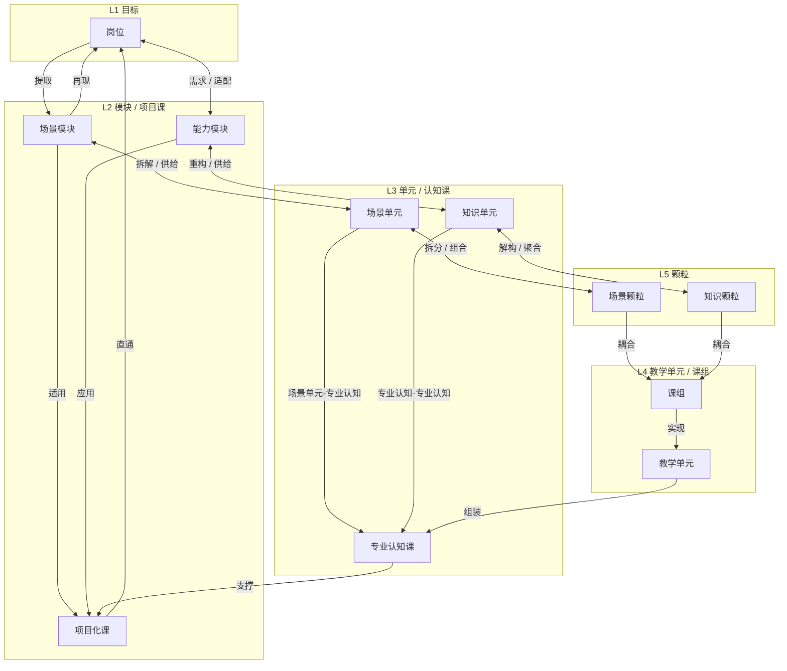

# 基于 OBE 理念的专业课程架构 — 概念关系梳理

> 依据架构示意图整理，不涉及项目代码或数据文件。

## 一、概念在架构中的层级（自上而下）

| 层级 | 中央主线 | 左侧（场景链） | 右侧（能力/知识链） |
|------|----------|----------------|---------------------|
| L1 目标 | **岗位** | — | — |
| L2 模块/课 | **项目化课** | **场景模块** | **能力模块** |
| L3 单元/课 | **专业认知课** | **场景单元** | **知识单元** |
| L4 单元/课组 | **教学单元 / 课组** | — | — |
| L5 颗粒 | — | **场景颗粒** | **知识颗粒** |

**层级含义**：岗位是顶层职业目标；其下分解为三类并列载体（场景模块、项目化课、能力模块）；再向下到单元级、教学单元/课组层与颗粒层。最底层仅由场景颗粒、知识颗粒构成；颗粒先耦合为课组，再由课组实现教学单元。

---

## 二、三条纵向链路

### 2.1 中央主线（课组 → 教学单元 → 认知课 → 项目化课 → 岗位）

> **层级位置**自上而下是：岗位 → 项目化课 → 专业认知课 → 教学单元 / 课组 → 颗粒。  
> **中央主线**是正向建构/供给方向，自下而上汇聚，**终点是岗位**；与左右两链的「供给 / 组合 / 聚合 / 适配 / 再现」一致。

```
课组 ──实现──→ 教学单元 ──组装──→ 专业认知课 ──支撑──→ 项目化课 ──直通──→ 岗位
课组为颗粒耦合后的承接层                                                建构终点
```

| 起点（下） | 终点（上） | 关系动词 | 方向说明 |
|------------|------------|----------|----------|
| 课组 | 教学单元 | **实现** | 课组承接颗粒耦合结果，向上实现教学单元 |
| 教学单元 | 专业认知课 | **组装** | 教学单元向上组装为专业认知课 |
| 专业认知课 | 项目化课 | **支撑** | 专业认知课自下而上支撑项目化课 |
| 项目化课 | 岗位 | **直通** | 项目化课经直通抵达岗位，岗位为中央主线终点 |

### 2.2 左侧场景链（场景颗粒 → … → 场景模块 → 岗位）

> 正向建构自下而上，**终点是岗位**；向下为反向拆解。

```
场景颗粒 ⇄ 场景单元 ⇄ 场景模块 ⇄ 岗位
```

| 上层 | 下层 | 向下（分解） | 向上（回聚） |
|------|------|--------------|--------------|
| 岗位 | 场景模块 | **提取** | **再现** |
| 场景模块 | 场景单元 | **拆解** | **供给** |
| 场景单元 | 场景颗粒 | **拆分** | **组合** |

### 2.3 右侧能力/知识链（岗位 ↔ 能力模块 ↔ 知识单元 ↔ 知识颗粒）

```
岗位 ⇄ 能力模块 ⇄ 知识单元 ⇄ 知识颗粒
```

| 上游 | 下游 | 向下（分解） | 向上（回聚） |
|------|------|--------------|--------------|
| 岗位 | 能力模块 | **需求** | **适配** |
| 能力模块 | 知识单元 | **重构** | **供给** |
| 知识单元 | 知识颗粒 | **解构** | **聚合** |

---

## 三、横向汇聚关系（L2、L5 → L4）

### 3.1 模块层 → 项目化课

| 来源 | 目标 | 关系动词 |
|------|------|----------|
| 场景模块 | 项目化课 | **适用** |
| 能力模块 | 项目化课 | **应用** |

含义：场景侧模块「适用」到项目化课；能力侧模块「应用」到项目化课。项目化课承接左右两链，并经**直通**与中央主线一并汇聚至**岗位**。

### 3.2 颗粒层 → 课组（耦合）

| 来源 | 目标 | 关系动词 |
|------|------|----------|
| 场景颗粒 | 课组 | **耦合** |
| 知识颗粒 | 课组 | **耦合** |

含义：最底层两侧颗粒不直接耦合到教学单元，而是先向**课组**汇聚；课组是颗粒耦合后的组织单元，再通过**实现**关系形成可教学的教学单元。

### 3.3 课组 → 教学单元（实现）

| 来源 | 目标 | 关系动词 |
|------|------|----------|
| 课组 | 教学单元 | **实现** |

含义：课组承接颗粒层的场景与知识组合，并向上落实为教学单元；教学单元不再与颗粒同处最底层。

### 3.4 单元层 → 专业认知课（L3 横向汇入中轴）

| 来源 | 目标 | 关系名称 |
|------|------|----------|
| 场景单元 | 专业认知课 | **场景单元-专业认知** |
| 知识单元 | 专业认知课 | **专业认知-专业认知** |

含义：L3 左右两翼的**场景单元**、**知识单元**分别汇入中央**专业认知课**，与中央主线「教学单元 → 组装 → 专业认知课」并列，共同构成认知课层的课程骨架。

---

## 四、主体概念的关系总图（逻辑）



---

## 五、概念关系速查表

| 概念 A | 概念 B | 关系 | 解读要点 |
|--------|--------|------|----------|
| 项目化课 | 岗位 | 直通 | 项目化课经直通抵达岗位，岗位为建构终点 |
| 场景模块 | 岗位 | 提取 ↓ / 再现 ↑ | 自岗位向下**提取**场景要素；场景模块向上**再现**岗位 |
| 岗位 | 能力模块 | 需求 ↓ / 适配 ↑ | 岗位提出能力需求，能力模块回适岗位 |
| 场景模块 | 项目化课 | 适用 | 场景模块用于项目化课的设计与实施 |
| 能力模块 | 项目化课 | 应用 | 能力模块在项目化课中落地应用 |
| 场景模块 | 场景单元 | 拆解 ↓ / 供给 ↑ | 模块拆为单元，单元向上供给模块 |
| 能力模块 | 知识单元 | 重构 ↓ / 供给 ↑ | 能力导向重构知识单元，单元供给能力模块 |
| 场景单元 | 场景颗粒 | 拆分 ↓ / 组合 ↑ | 单元拆为颗粒，颗粒组合成单元 |
| 场景单元 | 专业认知课 | 场景单元-专业认知 | 场景单元汇入中央专业认知课 |
| 知识单元 | 知识颗粒 | 解构 ↓ / 聚合 ↑ | 知识解构到颗粒，颗粒聚合为单元 |
| 知识单元 | 专业认知课 | 专业认知-专业认知 | 知识单元汇入中央专业认知课 |
| 场景颗粒 | 课组 | 耦合 | 场景侧最小要素先参与构成课组 |
| 知识颗粒 | 课组 | 耦合 | 知识侧最小要素先参与构成课组 |
| 课组 | 教学单元 | 实现 | 课组实现为可教学的教学单元 |
| 教学单元 | 专业认知课 | 组装 | 教学单元是专业认知课的组成砖块 |
| 专业认知课 | 项目化课 | 支撑 | 认知层课程支撑项目化课的实施 |

---

## 六、两个阅读方向：从上到下拆 · 从下到上托（非第十一个概念）

讲解与演示（`讲故事.md`、金字塔页「向上看 / 向下看」）里的 **双视角**，**不是** OBE 主体概念之外的节点，也**不必**在 `dependance/exampleRelation.json` 里单独建一条叫「向下拆 / 向上汇总」的边。

**默认讲解用「向上托」**；需要讲岗位需求拆解时，再切换到「向下拆」。

| 讲解说法 | 默认？ | 走哪些概念 | 看关系时用哪一侧动词 | 叙事重心 |
|----------|--------|------------|----------------------|----------|
| **从下到上托 / 汇总**（施工 · 正向施工） | **是** | 主体概念全开：颗粒 → 课组/教学单元 → 认知课/项目课 → 岗位；含中央 **课组、教学单元、专业认知课、项目化课** | 「**向上（回聚）**」：耦合、实现、组装、场景单元-专业认知、专业认知-专业认知、支撑、直通… | 各颗粒度**汇总成课**，一路托到岗位 |
| **从上到下拆**（岗位驱动 · 反向设计） | 否（补充） | **仅** 岗位 + **场景链** + **能力/知识链** 至**最小颗粒**；**不含** 项目化课、专业认知课、教学单元、课组 | 「**向下（分解）**」：提取、需求、拆解、拆分、解构、重构… | 从岗位往下拆到模块、单元、颗粒（不展开中轴三门课与课组） |

**向下拆的边界（必记）**

- **有**：岗位 → 场景模块 → 场景单元 → 场景颗粒；岗位 → 能力模块 → 知识单元 → 知识颗粒。  
- **无**：项目化课、专业认知课、教学单元、课组及其相关边（适用/应用、实现、组装、支撑、直通、耦合、场景单元-专业认知、专业认知-专业认知 等在中轴上的关系**仅在向上托时展示**）。  
- 与演示页一致：向下看时保留**岗位**节点，仅左右两链连到颗粒。

**与数据文件的关系**

- `dependance/exampleRelation.json` / `dependance/data.js`：每条关联只存**具体动词**及 `出` / `入`；阅读方向写在 `meta.阅读方向`。  
- 演示页：**向上看（默认）** → 回聚方向 + 完整中轴；**向下看** → 分解方向 + 隐藏中轴三类概念。

**中央主线（仅「向上托」时成立）**

```
颗粒 →耦合→ 课组 →实现→ 教学单元 →组装→ 专业认知课 →支撑→ 项目化课 →直通→ 岗位
（左右颗粒经耦合汇入课组；课组实现教学单元；场景单元/知识单元经 L3 横向汇入专业认知课）
```

向下拆**不画**上述中轴链，只讲左右两链从岗位拆到颗粒。

### 6.1 与示意图两侧轴线的对应（背景框架）

示意图在主体两侧标注的两条方法论轴，与上表两行一一对应，**不单独作为第十一个实体**：

| 正向施工（自下而上托） | 反向设计（自上而下拆） | 与主体层级的粗略对应 |
|------------------------|------------------------|----------------------|
| 建构 | 知识 | 颗粒 / 单元层 |
| 筑基 | 课程 | 单元 / 课层 |
| 养成 | 能力 | 模块层 |
| 胜任 | 职场 | 岗位层 |

主体关系以**中央金字塔 + 左场景链 + 右能力知识链**为准；**拆 / 托**是阅读方向，不是新增概念类型。

---

## 七、一句话归纳

**场景模块**（适用）、**能力模块**（应用）汇入**项目化课**；双链向下拆解至最底层**场景颗粒**与**知识颗粒**，两类颗粒先与**课组****耦合**，课组再**实现**中央**教学单元**；随后**场景单元**（场景单元-专业认知）、**知识单元**（专业认知-专业认知）与**教学单元**（组装）一并汇入**专业认知课**，再**支撑**项目化课、**直通**抵达**岗位**（建构终点）——形成「颗粒独立最底层、课组承接耦合、课组实现教学单元、自下而上直达岗位胜任」的 OBE 课程架构。
